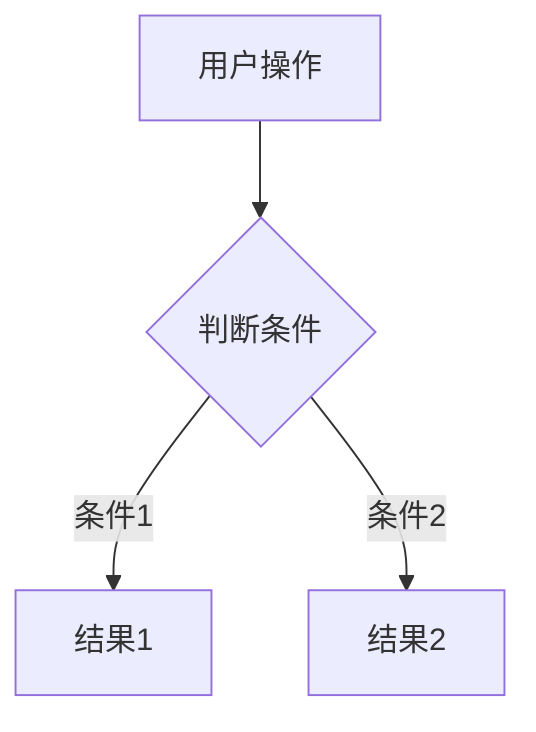

---
# 注意不要修改本文头文件，如修改，AI Coding Assistant将按照默认逻辑设置
type: manual
---
# Step 02: 交互设计 [MODE: DESIGN]

> 所属Agent: UX Agent
> 前置条件: ✅ Step 01 已完成（前置检查通过，知识库已加载）
> 完成标志: ✅ 所有界面交互设计已完成
> 行为模式: 📐 设计模式 — 感受先行，结构化布局

---

## 📋 执行清单

### 2.1 分析UI需求

- [ ] 对每个界面明确：入口（从哪里打开）、出口（关闭后回到哪里）
- [ ] 确定界面间的导航关系
- [ ] 识别核心交互路径和次要交互路径

### 2.2 设计交互流程

- [ ] 绘制主流程图（使用mermaid flowchart）



- [ ] 绘制异常流程（网络错误、数据异常等）
- [ ] 列出所有异常情况及处理方式和用户提示

### 2.3 设计界面布局

对每个界面执行：

- [ ] **设计目标**: 描述此界面要达成什么目标
- [ ] **设计原则**: 简洁性、一致性、反馈性
- [ ] **布局草图**: 使用ASCII字符绘制

```
┌─────────────────────────────────┐
│           标题栏                │
├─────────────────────────────────┤
│                                 │
│           主内容区              │
│                                 │
├─────────────────────────────────┤
│           操作按钮区            │
└─────────────────────────────────┘
```

- [ ] **元素列表**: 列出所有元素（类型、位置、交互方式）

### 2.4 定义交互状态

对每个可交互元素定义4种状态：

| 元素 | 默认状态 | 悬停状态 | 点击状态 | 禁用状态 |
|------|----------|----------|----------|----------|
| [元素名] | [描述] | [描述] | [描述] | [描述] |

### 2.5 定义反馈规范

| 操作 | 反馈类型 | 反馈内容 | 持续时间 |
|------|----------|----------|----------|
| [操作名] | 动画/音效/提示 | [具体内容] | [时长] |

---

## ⚠️ 常见陷阱

| 陷阱 | 后果 | 避免方法 |
|------|------|----------|
| **状态遗漏** - 只定义默认状态 | 程序实现不完整 | 强制检查4种状态 |
| **流程不完整** - 忽略异常流程 | 用户体验差 | 绘制完整流程图 |
| **布局描述模糊** - 用文字而非图示 | 程序理解困难 | 使用ASCII布局图 |
| **交互过于复杂** | 用户难以理解 | 遵循简洁原则 |

---

## ✅ 完成标志

```
✅ Step 02 完成检查:
- [ ] 所有界面交互流程已设计（含主流程+异常流程）
- [ ] 所有界面布局已绘制（ASCII图）
- [ ] 所有交互元素状态已定义（默认/悬停/点击/禁用）
- [ ] 反馈规范已定义
- [ ] 异常情况处理已列出
→ 加载 step-03_文档输出与确认.md
```
