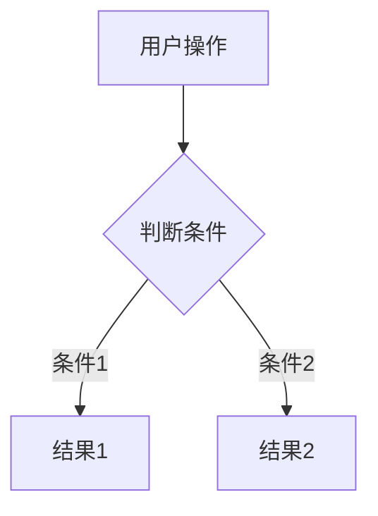

---
# 注意不要修改本文头文件，如修改，AI Coding Assistant将按照默认逻辑设置
type: manual
---
# UX设计文档模板

> 使用说明：复制此模板到 `.GameDev/{功能名称}/02_UX设计.md`，填写具体内容

```markdown
# {功能名称} - UX设计文档

> 需求ID: REQ-XXX
> 设计日期: YYYY-MM-DD
> 设计状态: 待确认 / 已确认

---

## 📑 章节索引

| 章节 | 标题 | 小节 |
|------|------|------|
| [第一章](#第一章-设计概述) | 设计概述 | [1.1 设计目标](#11-设计目标) · [1.2 设计原则](#12-设计原则) |
| [第二章](#第二章-界面设计) | 界面设计 | [2.1 界面列表](#21-界面列表) · [2.2 界面详情](#22-界面详情) |
| [第三章](#第三章-交互流程) | 交互流程 | [3.1 主流程](#31-主流程) · [3.2 异常流程](#32-异常流程) |
| [第四章](#第四章-交互规范) | 交互规范 | [4.1 状态定义](#41-状态定义) · [4.2 反馈规范](#42-反馈规范) |

---

# 第一章 设计概述

## 1.1 设计目标

[描述UX设计要达成的目标]
- 目标1: [具体目标]
- 目标2: [具体目标]

## 1.2 设计原则

- **简洁性**: [如何保持界面简洁]
- **一致性**: [如何保持交互一致]
- **反馈性**: [如何提供操作反馈]

---

# 第二章 界面设计

## 2.1 界面列表

| 界面名称 | 类型 | 入口 | 说明 |
|----------|------|------|------|
| [界面1] | 弹窗/全屏/嵌入 | [从哪里打开] | [简要说明] |

## 2.2 界面详情

### 界面: [界面名称]

**布局描述:**
```
┌─────────────────────────────────┐
│           标题栏                │
├─────────────────────────────────┤
│                                 │
│           主内容区              │
│                                 │
├─────────────────────────────────┤
│           操作按钮区            │
└─────────────────────────────────┘
```

**元素列表:**
| 元素 | 类型 | 位置 | 交互 |
|------|------|------|------|
| [元素1] | 按钮/文本/图标 | [位置描述] | [点击/长按/拖拽] |

---

# 第三章 交互流程

## 3.1 主流程



## 3.2 异常流程

| 异常情况 | 处理方式 | 用户提示 |
|----------|----------|----------|
| [异常1] | [处理] | [提示文案] |

---

# 第四章 交互规范

## 4.1 状态定义

| 元素 | 默认状态 | 悬停状态 | 点击状态 | 禁用状态 |
|------|----------|----------|----------|----------|
| [按钮1] | [描述] | [描述] | [描述] | [描述] |

## 4.2 反馈规范

| 操作 | 反馈类型 | 反馈内容 | 持续时间 |
|------|----------|----------|----------|
| [操作1] | 动画/音效/提示 | [具体内容] | [时长] |

---

## 📋 策划确认

- [ ] 界面布局符合需求
- [ ] 交互流程完整
- [ ] 用户体验流畅
- [ ] 无遗漏功能点

**确认人**: [策划Agent]
**确认日期**: YYYY-MM-DD
**确认意见**: [通过/需修改: 修改意见]
```
