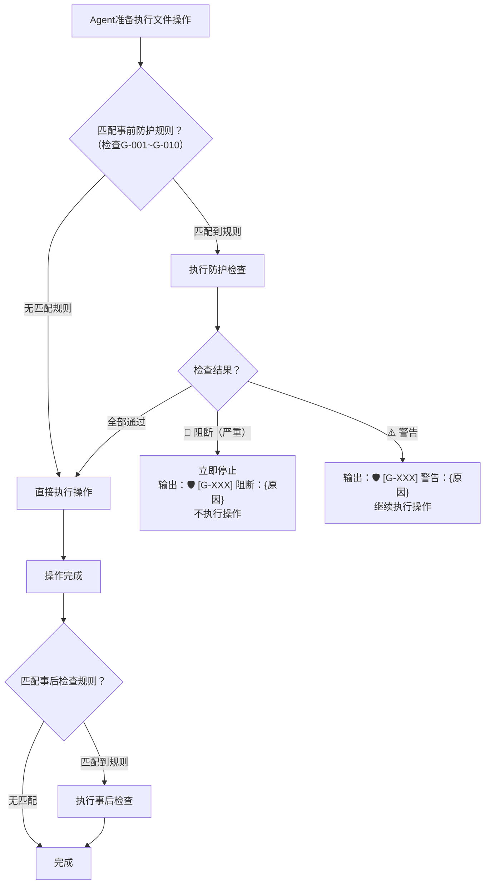

---
# 注意不要修改本文头文件，如修改，AI Coding Assistant将按照默认逻辑设置
type: manual
---
# 🛡️ 事件驱动防护规则（借鉴 ECC Hooks System）

> **版本**: v1.0
> **创建时间**: 2026-03-12
> **目标**: 将"禁止事项"从被动文字约束升级为主动事件驱动检查，在关键操作**执行前自动拦截**、**执行后自动检查**
> **加载时机**: 🔴 程序Agent编码阶段必须加载 | 🟡 其他Agent涉及文件操作时按需加载

---

## 📖 核心理念

```
当前防护（被动）：
用户请求 → AI执行 → 阶段流转时手动检查 → 发现问题才回退
                ↑ 没有事前拦截

升级后防护（主动）：
用户请求 → 🛡️事前防护检查 → 通过才执行 → 🔔事后自动检查
               ↑ 事前自动拦截              ↑ 事后自动修正提示
```

**三层防护体系**：
1. **🛡️ 事前防护（Pre-Action Guards）**：操作执行前自动拦截危险行为
2. **🔔 事后检查（Post-Action Guards）**：操作完成后自动检查遗漏问题
3. **🚧 质量门禁（已有）**：阶段流转时的内容质量检查

---

## 🛡️ 事前防护规则（Pre-Action Guards）

> **执行时机**：在以下操作**执行前**，Agent必须自动检查对应规则。
> **适用Agent**：所有涉及文件操作的Agent（主要是程序Agent）。
> **执行方式**：在修改/创建/删除任何文件前，自动匹配下表中的触发条件，执行对应检查。

| 防护ID | 触发条件 | 检查内容 | 未通过处理 | 严重级 |
|--------|---------|---------|-----------|--------|
| **G-001** | 任何文件编辑操作 | 文件路径不含 `.meta` | 🚫 **阻断** — 立即停止，输出警告 | 🔴 严重 |
| **G-002** | 任何文件编辑操作 | 文件路径不在 `Library/` 或 `Temp/` 目录下 | 🚫 **阻断** — 立即停止，输出警告 | 🔴 严重 |
| **G-003** | 创建新 `.cs` 脚本文件 | 命名空间是否符合项目规范（功能名称命名空间） | ⚠️ **警告** — 输出建议，继续执行 | 🟡 警告 |
| **G-004** | 修改 ScriptableObject 类 | 是否需要同步修改序列化数据/资产文件 | ⚠️ **提示** — 提醒检查数据兼容性 | 🟡 警告 |
| **G-005** | 修改 MonoBehaviour 类 | 外部引用（GetComponent/Find等返回值）是否有 null 检查 | ⚠️ **提示** — 提醒 null 安全 | 🟡 警告 |
| **G-006** | 删除任何文件 | 是否有其他文件引用此文件（搜索类名/命名空间） | 🚫 **阻断** — 必须确认无引用或用户明确同意后才可删除 | 🔴 严重 |
| **G-007** | 修改公共接口（public方法签名变更） | 是否有下游依赖需要同步更新（搜索调用方） | ⚠️ **警告** — 列出受影响的文件，提醒同步修改 | 🟡 警告 |
| **G-008** | 安装新 Unity Package | 是否已获得用户确认 | 🚫 **阻断** — 必须用户明确同意 | 🔴 严重 |
| **G-009** | 修改 `.ai-rules/rules/` 下的规则文件 | 是否按照迭代四步法执行（有5 Why分析 + 日志记录） | ⚠️ **检查** — 确认迭代流程已执行 | 🟡 警告 |
| **G-010** | 修改 `ProjectSettings/` 下的文件 | 是否需要通知团队/同步其他配置 | ⚠️ **警告** — 提醒检查影响范围 | 🟡 警告 |

### 防护规则执行流程



### 事前防护输出格式

当防护规则被触发时，必须在输出中明确标注：

**阻断输出格式**：
```
🛡️ [G-001] 🚫 阻断：检测到目标文件为 .meta 文件（{文件路径}），此操作被自动拦截。
   ↳ 原因：.meta 文件由 Unity 自动管理，手动修改会导致资源引用丢失。
   ↳ 处理：已取消本次操作。
```

**警告输出格式**：
```
🛡️ [G-007] ⚠️ 警告：修改了公共接口 {方法签名}，以下文件可能受影响：
   ↳ {文件列表}
   ↳ 处理：请确认是否需要同步更新上述文件。继续执行。
```

---

## 🔔 事后检查规则（Post-Action Guards）

> **执行时机**：在以下操作**完成后**，Agent自动执行对应检查。
> **适用Agent**：主要是程序Agent（编码完成后）。
> **执行方式**：编码完成后、质量门禁前，自动执行下表中匹配的检查。

| 防护ID | 触发条件 | 检查内容 | 处理方式 | 严重级 |
|--------|---------|---------|---------|--------|
| **G-101** | 编码完成后 | 是否有 `Debug.Log` / `Debug.LogWarning` / `Debug.LogError` 残留（非必要日志） | ⚠️ **提示** — 列出残留位置，建议清理 | 🟡 警告 |
| **G-102** | 编码完成后 | 是否有未处理的 `TODO` / `FIXME` / `HACK` 注释 | ⚠️ **列出** — 逐条列出待处理项 | 🟡 警告 |
| **G-103** | 修改 Manager/Service 类后 | 是否需要更新全局技术文档 `全局技术文档.md` | ⚠️ **提示** — 提醒同步更新文档 | 🟡 警告 |
| **G-104** | 修改数据结构（class/struct 字段变更）后 | 是否考虑了序列化兼容性（旧存档能否正常加载） | ⚠️ **提示** — 提醒检查数据迁移 | 🟡 警告 |
| **G-105** | 需求完成后（最终流转前） | Frontmatter 状态追踪是否已更新 | ⚠️ **自动检查** — 读取文档头确认状态 | 🟡 警告 |
| **G-106** | 涉及UI组件编码后 | EditorSetupTool 是否已同步更新 | ⚠️ **提示** — 提醒检查工具同步 | 🟡 警告 |
| **G-107** | 新增/修改事件订阅后 | `OnDestroy` 中是否有对应的事件取消订阅 | ⚠️ **警告** — 可能导致内存泄漏 | 🟡 警告 |

### 事后检查输出格式

```
🔔 [事后检查] 编码完成，自动执行以下检查：
  ✅ [G-101] Debug.Log 检查 — 通过（无残留日志）
  ⚠️ [G-102] TODO 检查 — 发现2处待处理：
     ↳ Line 45: // TODO: 优化排序算法
     ↳ Line 128: // FIXME: 边界条件未处理
  ✅ [G-103] 全局技术文档 — 不涉及Manager类修改，跳过
  ⚠️ [G-104] 数据结构兼容性 — 修改了 PlayerData 类，请确认旧存档兼容性
  ✅ [G-107] 事件订阅 — 所有订阅均有对应取消

📊 事后检查结果：5通过 / 2警告 / 0阻断
```

---

## 📌 防护规则嵌入位置（与现有 Step 文件集成）

### 程序Agent step-03（编码实现）

在编码实现步骤中嵌入**事前防护**：
- **每次修改文件前**：自动匹配 G-001~G-010 规则
- 🔴 阻断规则触发 → 停止操作
- 🟡 警告规则触发 → 输出警告后继续

### 程序Agent step-04（完成检查）

在完成检查步骤中嵌入**事后检查**：
- **编码全部完成后，质量门禁前**：自动执行 G-101~G-107 检查
- 事后检查结果并入质量门禁评估

### 其他Agent

- **主程Agent**：修改技术文档时触发 G-009（涉及规则文件时）
- **策划Agent**：一般不涉及代码文件操作，防护规则不适用
- **QA Agent**：编写测试代码时触发 G-001、G-002、G-003

---

## 🔧 防护规则维护

### 新增防护规则的标准

满足以下**任一条件**可新增防护规则：
1. **同一问题出现2次以上** — 说明文字约束不够，需要自动防护
2. **后果严重且不可逆** — 如删除文件、修改配置等高危操作
3. **QA/对抗审查高频发现项** — 反复出现的代码质量问题

### 维护规则

- 防护规则总数控制在 **20条以内**（事前10条 + 事后10条），避免检查过多拖慢效率
- 每条规则必须有明确的**触发条件**和**处理方式**
- 定期审计（`/gd:audit`）时检查防护规则的有效性
- 无效规则（从未触发或已被其他机制覆盖）应移除

---

## 📊 防护规则 vs 禁止事项 vs 质量门禁 对比

| 维度 | 🚫 禁止事项 | 🛡️ 防护规则 | 🚧 质量门禁 |
|------|------------|------------|------------|
| **执行时机** | 全程（被动约束） | 操作前/后（主动检查） | 阶段流转时（节点检查） |
| **检查粒度** | 笼统（"禁止修改.meta"） | 精确（每次文件操作都检查路径） | 综合（检查整体质量） |
| **防护方式** | 依赖AI自觉遵守 | **自动匹配+自动拦截** | 手动对照清单检查 |
| **触发频率** | 无触发（持续有效） | 每次文件操作时触发 | 每次阶段流转时触发 |
| **互补关系** | 底线声明 | 实时执行层 | 总结验证层 |

**三者共同构成完整的防护纵深**：
```
禁止事项（底线） → 防护规则（实时拦截） → 质量门禁（阶段验证）
```

---

*文档创建时间：2026-03-12*
*本文件为子规则文件，由程序Agent编码阶段加载*